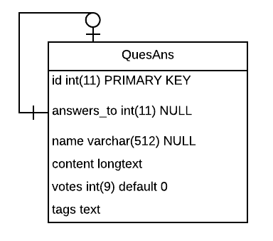

## Make a backup of Stack Overflow
==================================


#### 1. Guessing the Data Structure

We need to find out what is the most probable structure they use to store the data.

When you go to a question in SO, you have an uri something like: /questions/330/name-of-the-question
Where the ID of the question is 330; when you randomly update the question ID, in some cases your url will be completed with the name of the question, and in other cases you will be redirected to another question ID, and the ID you added will be added at the end of the string after completing the question name. For example:

1. you go to /questions/330
2. you get redirected to a url like: /questions/221/question-name-or-title/330#330
We can see that that wasn’t a question, but an answer. We can safely assume after several random tests that the data structure for them is the same. In this case I’ll put them in a table with a FK (model level only) to the same table.



We’ll use a serialized field for tags but will also store them in tables item_tag and tag to keep a better normal structure.

Now that we have found the main structure (we are not interested in the users and dates of publication, we could use comments but for the purpose of the practical example we’ll ditch them) we’ll go to the DOM to see how we can navigate the data to later scrape it.

_________________________________

#### 2. Mapping the DOM structure

Brave Browser dev-tools offers the same as chrome, we can copy the css selector, JS path, or the X path. We’ll use the XPath in our PHP code.

*By inspecting the DOM, we can find the Xpaths for:*

The question’s name: `//div[@id="question-header"]/h1/a`

The question’s ID: `//*[@id="question"]/@data-questionid`

The question’s content: `//div[@id="question"]/div[@class="post-layout"]/div[@class="postcell post-layout--right"]/div[@class="post-text"]`

The question’s votes: `//*[@id="question"]/div[2]/div[1]/div/div`

The question’s tags: `//div[@id="question"]/div[@class="post-layout"]/div[@class="postcell post-layout--right"]/div[@class="post-taglist grid gs4 gsy fd-column"]/div/a`

Then we go and find the question’s answers: `//*[@id="answers"]/div[contains(@class, "answer")]`

And we iterate through them, using every field of interest in the same way we did with the question.

_________________________________

#### 3. Creating the Data Structure

We follow the structure we assumed that contemplate the behavior of Stack Overflow, we use MysQL to create 3 tables, ‘ques_ans’ for questions and answers, ‘tags’ for the tags we find in each question or answer, and ‘item_tag’ because multiplicity demands so (one question can have one or more tags, one tag can belong to one or more questions):

```SQL
CREATE TABLE `ques_ans` (
  `id` int(11) NOT NULL,
  `title` varchar(256) DEFAULT NULL,
  `answers_to` int(11) DEFAULT NULL,
  `content` text NOT NULL,
  `votes` varchar(10) DEFAULT NULL,
  `tags` varchar(128) DEFAULT NULL,
  PRIMARY KEY (`id`)
) ENGINE=InnoDB DEFAULT CHARSET=latin1

CREATE TABLE `tags` (
  `id` int(11) NOT NULL AUTO_INCREMENT,
  `name` varchar(64) NOT NULL,
  PRIMARY KEY (`id`),
  UNIQUE KEY `name` (`name`)
) ENGINE=InnoDB DEFAULT CHARSET=latin1 

CREATE TABLE `item_tag` (
  `id` int(11) NOT NULL AUTO_INCREMENT,
  `item_id` int(11) NOT NULL,
  `tag_id` int(11) NOT NULL,
  PRIMARY KEY (`id`)
) ENGINE=InnoDB DEFAULT CHARSET=latin1
```

_________________________________

#### 4. Running the script

Make sure you add the credentials in the db connection, and to setup the starting point (first question you'll start with)
and the range in which the script will run. Then from the CLI:

`php stack_overflow.php`

Enjoy backing up Stack Overflow so you are safe finding answers when a huge EMP shuts down the internet =)

